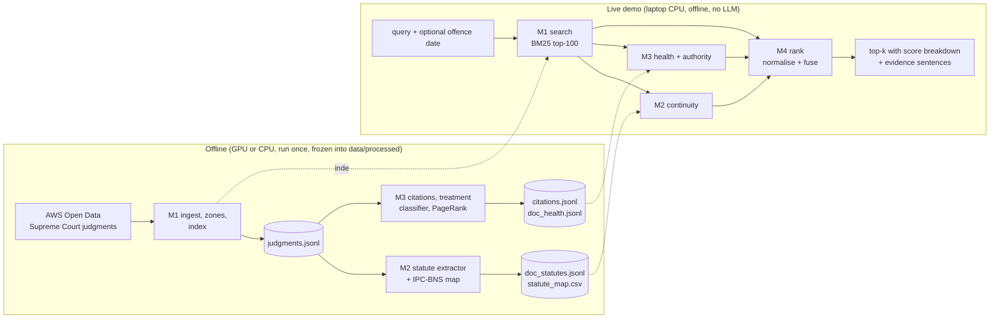

# Architecture

## The idea in one paragraph

A precedent can match a query perfectly and still be unsafe to cite, because (a) the statute it interpreted was replaced
(the BNS replaced the IPC on 1 July 2024) or (b) a later bench overruled, doubted or criticised it. Free tools rank by text
relevance only; paid tools show an overruled flag next to the results. LexShift uses statutory continuity and judicial
treatment **inside the ranking function**, and shows the evidence and a confidence behind every status. It never
declares a case "bad law": output is treatment signals with evidence, not legal advice.

## Pipeline



Nothing in the live path calls the network, a paid API or a language model. Anything that needed a GPU or an LLM
(classifier training or few-shot labelling) ran offline and its outputs are frozen files.

## The ranking function

```
final(q, d) = w_r * rel(q,d) + w_s * cont(q,d) + w_h * health(d) + w_a * auth(d)
```

| Signal | Meaning | Owner |
|---|---|---|
| `rel` | BM25 relevance of judgment d to query q, zone-weighted; min-max normalised over the top-100 candidates | M1 |
| `cont` | statutory continuity: how much of d's statutory basis carries over to the code that applies to q | M2 |
| `health` | lowered if a *valid* later bench overruled (0.1), doubted or criticised (0.6) d; otherwise 1.0 | M3 |
| `auth` | citation-graph PageRank over positive and neutral citations x bench strength | M3 |

Weights are tuned on the DEV queries only and reported on the TEST queries. Systems compared in the ablation:
**B0** BM25 only, **B1** + statutory continuity, **full** (+ health + authority).

Three design rules the whole team follows:

1. **Old IPC judgments are not dead.** BNS queries still retrieve IPC precedents; penalise only in proportion to how
   much the law changed (section 358 BNS preserves liability for earlier offences).
2. **No raw keyword matching for treatment.** Classify only passages where a specific earlier case is cited.
   "Objection overruled" and "set aside on appeal" are not overruling a precedent.
3. **Newer is not stronger.** Recency alone never raises or lowers a score; bench strength and treatment do.

## Where each IR concept lives in the code

Status: **planned** unless stated. Update this table in the commit that implements the piece, because the report must say
where each concept is in the code.

| IR concept | Where | Owner | Status |
|---|---|---|---|
| What is a document, metadata as parametric fields | `m1_index/ingest.py` | M1 | planned |
| Tokenisation, case folding, stop words, Porter stemming | `m1_index/tokenizer.py` | M1 | planned |
| Inverted index, positional index, document frequency | `m1_index/index.py` | M1 | planned |
| Zone index | `m1_index/zones.py`, `m1_index/index.py` | M1 | planned |
| Parametric index (year, bench size) | `m1_index/index.py` | M1 | planned |
| Boolean AND/OR/NOT, postings intersection by increasing df | `m1_index/query_parser.py` | M1 | planned |
| Phrase and proximity queries (`/s`, `/p`, `/k`) | `m1_index/query_parser.py` | M1 | planned |
| tf-idf (lnc.ltc), BM25, heap-based top-K | `m1_index/scoring.py` | M1 | planned |
| Tiered index / champion lists (stretch) | `m1_index/index.py` | M1 | planned |
| Normalisation to a controlled vocabulary | `m2_statute/mapping.py` | M2 | planned |
| Query expansion (BNS 103 reaches IPC 302), parametric filtering by date | `m2_statute/query_parser.py`, `m2_statute/matcher.py` | M2 | planned |
| Jaccard / cosine on section text (stretch) | `m2_statute/mapping.py` | M2 | planned |
| Citation graph, PageRank (own power iteration), static quality score g(d) | `m3_treatment/graph.py`, `m3_treatment/scores.py` | M3 | implemented and tested on a synthetic corpus; not yet run on the real corpus |
| Proximity windows, Jaccard matching, corpus-driven stop list | `m3_treatment/windows.py`, `m3_treatment/resolver.py` | M3 | implemented and tested; not yet run on the real corpus |
| Net score (relevance combined with static quality scores g(d)) | `m4_rank/fusion.py` | M4 | implemented; tested on fixtures, not yet on real data |
| Score normalisation (min-max, identity) | `m4_rank/normalize.py` | M4 | implemented; see DECISIONS.md D-006 |
| Heap-based top-K over the fused scores | `m4_rank/fusion.py` | M4 | implemented |
| P@k, Recall@k, MAP, nDCG, harmful@k, bootstrap intervals | `eval/metrics.py` | M4 | implemented; checked against hand-computed values |
| Ablation B0 / B1 / full, DEV-only weight tuning | `eval/run_ablation.py`, `eval/tuning.py` | M4 | implemented; needs the real modules and the hand-made qrels |
| Pooling of the top-20 of every system for judging, blind and incremental | `eval/pool.py` | M4 | implemented; needs the real modules to pool real documents |
| Inter-judge agreement (percent, Cohen's kappa) and qrels construction | `eval/agreement.py`, `eval/make_qrels.py` | M4 | implemented; checked against hand-computed kappa |

Libraries are allowed but must be explained in IR terms in the report: for example `rank_bm25` (M1) is used only as a
sanity check against our own BM25, never in the live path.
